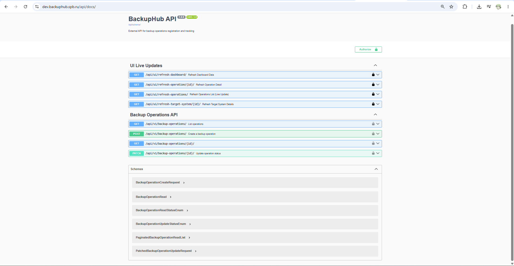

# Документация REST API BackupHub

## 1. Обзор
REST API системы BackupHub предоставляет безопасный и структурированный интерфейс для внешних систем для регистрации операций резервного копирования, обновления их статусов и получения операционных данных. API инкапсулирует сложную бизнес-логику (такую как версионирование конфигураций и управление временными метками) на стороне сервера, обеспечивая целостность данных и избавляя клиентские системы от необходимости управления внутренними состояниями базы данных.

## 2. Базовый URL и форматы
- **Базовый URL для внешних систем**: `https://dev.backuphub.spb.ru/api/v1/`
- **Базовый URL для внутреннего UI**: `https://dev.backuphub.spb.ru/api/ui/`
- **Формат запросов и ответов**: `application/json`

## 3. Аутентификация и авторизация

### 3.1. Аутентификация
Все запросы к API (за исключением эндпоинтов документации) требуют аутентификации через пользовательский заголовок.
- **Заголовок**: `X-API-Key`
- **Значение**: Валидный UUID, связанный с конкретной целевой системой (Target System).
- **Обработка ошибок**: Отсутствие ключа, невалидный ключ, просроченный ключ или ключ, принадлежащий неактивной системе, приведет к ответу `401 Unauthorized`.

### 3.2. Авторизация
API применяет строгие проверки прав владения с использованием класса разрешений `IsOwnerSystem`. Он проверяет цепочку владения: `TargetSystem` -> `BackupConfiguration` -> `BackupConfigurationVersion` -> `BackupOperation`.
- **Мера безопасности**: Если аутентифицированный пользователь пытается получить доступ к операции или изменить ее, принадлежащую другой целевой системе, API возвращает `404 Not Found` вместо `403 Forbidden`. Это предотвращает атаки перебора (enumeration), не раскрывая сам факт существования ресурсов, которыми пользователь не владеет.

## 4. Глобальные механизмы

### 4.1. Ограничение частоты запросов (Rate Limiting)
Для предотвращения злоупотреблений и обеспечения стабильности системы API использует `ApiKeyRateThrottle`.
- **Лимит**: 1000 запросов в минуту на один API-ключ.
- **Ответ при превышении**: `429 Too Many Requests`.

### 4.2. Пагинация
Эндпоинты, возвращающие списки, используют `StandardPagination`.
- **Размер страницы по умолчанию**: 50 элементов.
- **Максимальный размер страницы**: 500 элементов (настраивается через параметр запроса `page_size`).

### 4.3. Обработка ошибок
Все ошибки возвращаются в унифицированном формате JSON для обеспечения предсказуемого парсинга клиентскими приложениями.
```json
{
  "error": {
    "code": "validation_error",
    "message": "Читаемое человеком описание ошибки.",
    "details": {
      "имя_поля": ["Конкретная деталь ошибки"]
    }
  }
}
```

### 4.4. Маппинг статусов и регистронезависимость
API использует бизнес-терминологию, в то время как база данных хранит технические состояния. API прозрачно обрабатывает это преобразование.
- **Входные данные**: Регистронезависимые (принимаются `running`, `RUNNING`, `RuNnInG`, `success`, `failed`).
- **Выходные данные API**: Строго в нижнем регистре (`running`, `success`, `failed`).
- **Хранение в БД**: `in_progress`, `success`, `error`.

| Статус в API | Статус в БД | Описание |
| :--- | :--- | :--- |
| `running` | `in_progress` | Резервное копирование выполняется. |
| `success` | `success` | Резервное копирование успешно завершено. |
| `failed` | `error` | Резервное копирование завершилось с ошибкой. Поле `error_message` является необязательным. |

## 5. API операций резервного копирования (Backup Operations API)

### 5.1. Создание операции резервного копирования
Регистрирует начало новой операции резервного копирования. Серверная часть автоматически находит и привязывает операцию к текущей активной версии (`is_current=True`) указанной конфигурации.

- **Метод**: `POST`
- **Эндпоинт**: `/api/v1/backup-operations/`
- **Заголовки**: `X-API-Key: <ваш_uuid>`, `Content-Type: application/json`

**Пример cURL запроса**:
```bash
curl -X POST "https://dev.backuphub.spb.ru/api/v1/backup-operations/" \
  -H "X-API-Key: 550e8400-e29b-41d4-a716-446655440000" \
  -H "Content-Type: application/json" \
  -d '{
    "backup_configuration_id": 1,
    "hostname": "backup-server-01",
    "ip_address": "10.10.10.15"
  }'
```

**Успешный ответ (201 Created)**:
```json
{
  "id": 42,
  "backup_configuration_id": 1,
  "backup_configuration_version_id": 3,
  "target_system_id": 7,
  "hostname": "backup-server-01",
  "ip_address": "10.10.10.15",
  "status": "running",
  "started_at": "2026-07-20T10:00:00Z",
  "finished_at": null,
  "size_bytes": null,
  "storage_type": null,
  "storage_path": null,
  "metadata": null,
  "error_message": null
}
```

### 5.2. Получение списка операций
Возвращает пагинированный список операций, принадлежащих аутентифицированной целевой системе. Поддерживает фильтрацию.

- **Метод**: `GET`
- **Эндпоинт**: `/api/v1/backup-operations/`
- **Заголовки**: `X-API-Key: <ваш_uuid>`

**Параметры запроса (Query Parameters)**:
- `status`: Фильтр по статусу API (`running`, `success`, `failed`).
- `hostname`: Поиск по подстроке (без учета регистра).
- `backup_configuration_id`: Точное совпадение по ID конфигурации.
- `started_after`: Дата и время в формате ISO 8601 (включительно).
- `started_before`: Дата и время в формате ISO 8601 (включительно).
- `page`: Номер страницы (по умолчанию: 1).
- `page_size`: Количество элементов на странице (по умолчанию: 50, макс: 500).

**Пример cURL запроса**:
```bash
curl -X GET "https://dev.backuphub.spb.ru/api/v1/backup-operations/?status=success&page=1&page_size=25" \
  -H "X-API-Key: 550e8400-e29b-41d4-a716-446655440000"
```

**Успешный ответ (200 OK)**: Возвращает стандартный пагинированный JSON-объект, содержащий массив `results` и метаданные пагинации (`count`, `next`, `previous`).

### 5.3. Получение деталей операции
Возвращает полную информацию о конкретной операции.

- **Метод**: `GET`
- **Эндпоинт**: `/api/v1/backup-operations/{id}/`
- **Заголовки**: `X-API-Key: <ваш_uuid>`

**Пример cURL запроса**:
```bash
curl -X GET "https://dev.backuphub.spb.ru/api/v1/backup-operations/42/" \
  -H "X-API-Key: 550e8400-e29b-41d4-a716-446655440000"
```

**Успешный ответ (200 OK)**: Возвращает объект операции в том же формате, что и ответ эндпоинта создания. Возвращает `404 Not Found`, если ID не существует или не принадлежит аутентифицированной целевой системе.

### 5.4. Обновление статуса операции
Обновляет статус и метаданные результата выполняющейся операции. Серверная часть автоматически устанавливает временную метку `finished_at` при переходе статуса в терминальное состояние (`success` или `failed`).

- **Метод**: `PATCH`
- **Эндпоинт**: `/api/v1/backup-operations/{id}/`
- **Заголовки**: `X-API-Key: <ваш_uuid>`, `Content-Type: application/json`

**Пример cURL запроса (успешное завершение)**:
```bash
curl -X PATCH "https://dev.backuphub.spb.ru/api/v1/backup-operations/42/" \
  -H "X-API-Key: 550e8400-e29b-41d4-a716-446655440000" \
  -H "Content-Type: application/json" \
  -d '{
    "status": "success",
    "size_bytes": 5368709120,
    "storage_type": "s3",
    "storage_path": "s3://backup/prod/backup.sql.gz"
  }'
```

**Пример cURL запроса (завершение с ошибкой)**:
```bash
curl -X PATCH "https://dev.backuphub.spb.ru/api/v1/backup-operations/42/" \
  -H "X-API-Key: 550e8400-e29b-41d4-a716-446655440000" \
  -H "Content-Type: application/json" \
  -d '{
    "status": "failed",
    "error_message": "Connection timeout to S3"
  }'
```

**Ограничения**:
- Попытка изменить операцию, которая уже находится в терминальном статусе (`success` или `error`), вернет ошибку `400 Bad Request` с сообщением "Cannot modify a completed operation".

## 6. API для обновления пользовательского интерфейса (UI Live Updates API)
Эти эндпоинты предназначены для внутреннего использования фронтендом системы для обеспечения работы интерфейса в реальном времени без избыточной нагрузки на базу данных. Требуется аутентификация пользователя через сессию Django.

### 6.1. Обновление данных дашборда
Возвращает агрегированную статистику за последние 24 часа и список последних операций.

- **Метод**: `GET`
- **Эндпоинт**: `/api/ui/refresh-dashboard/`

### 6.2. Обновление списка операций
Возвращает отфильтрованный и пагинированный список операций для динамического обновления таблицы.

- **Метод**: `GET`
- **Эндпоинт**: `/api/ui/refresh-operations/`
- **Параметры запроса**: `q` (поиск), `status`, `hostname`, `configuration`, `page`

### 6.3. Обновление деталей конфигурации
Возвращает детали конкретной конфигурации и последние 10 связанных с ней операций.

- **Метод**: `GET`
- **Эндпоинт**: `/api/ui/refresh-configuration/{id}/`

### 6.4. Обновление деталей целевой системы
Возвращает детали целевой системы и последние 10 операций, связанных с ее конфигурациями.

- **Метод**: `GET`
- **Эндпоинт**: `/api/ui/refresh-target-system/{id}/`

## 7. Документация и инструменты
Интерактивная документация API доступна по следующим адресам:
- **Swagger UI**: `GET /api/docs/`
- **ReDoc**: `GET /api/redoc/`
- **OpenAPI Schema (JSON/YAML)**: `GET /api/schema/`



Вся документация автоматически генерируется с использованием `drf-spectacular` и всегда актуальна относительно текущего состояния кода. Эндпоинты логически сгруппированы по тегам (например, "Backup Operations API", "UI Live Updates") для удобства навигации.