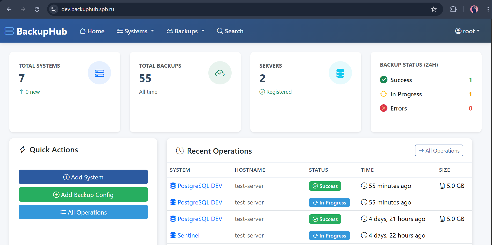
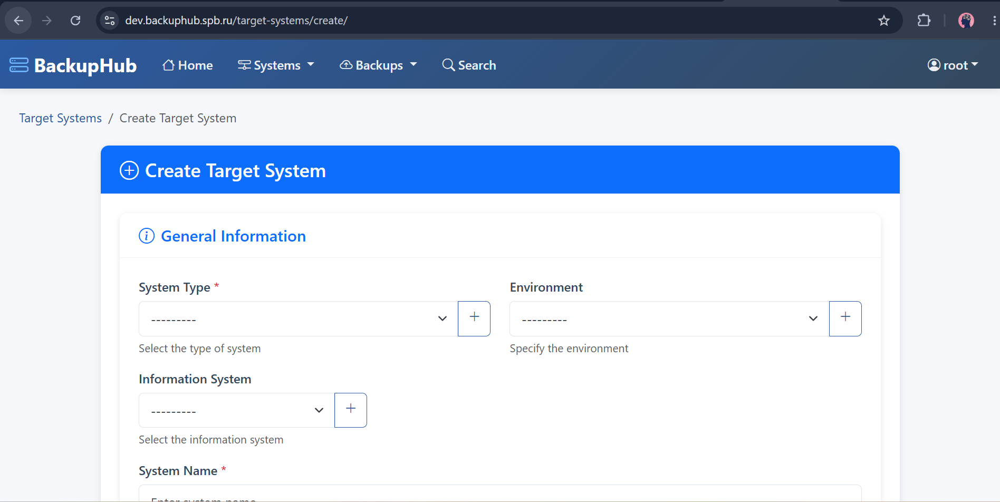
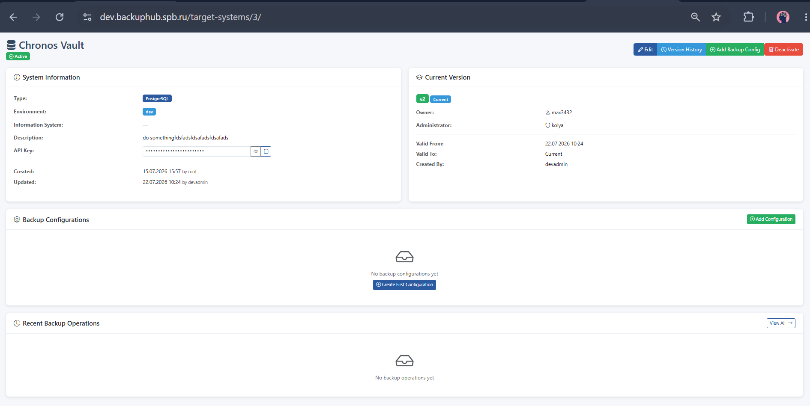
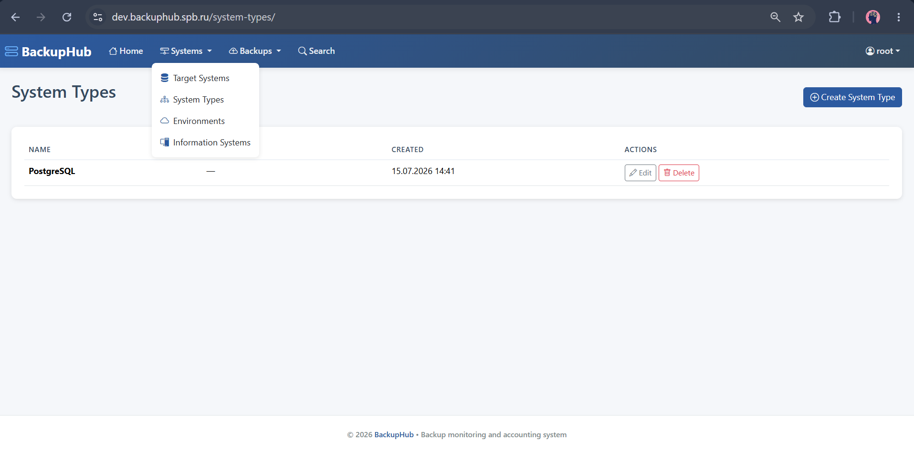
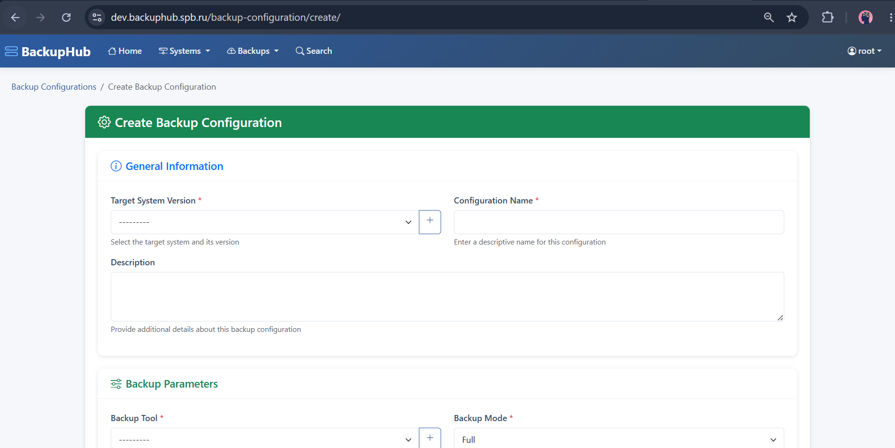
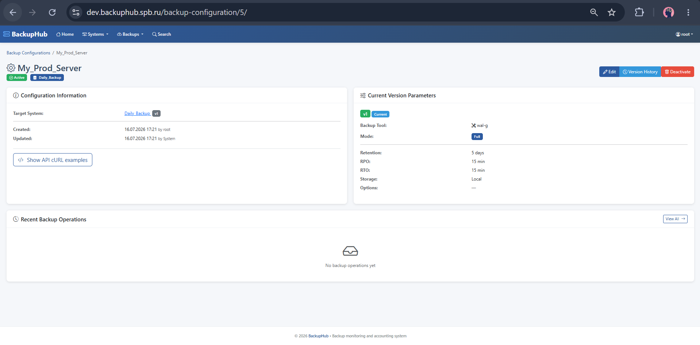
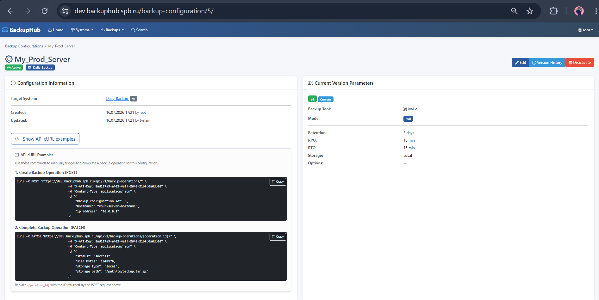
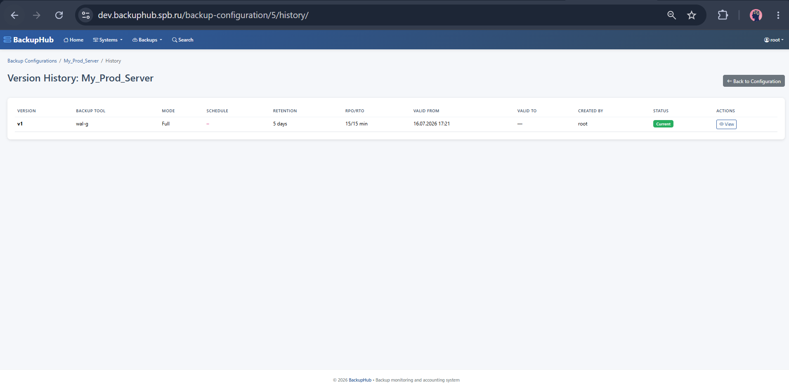
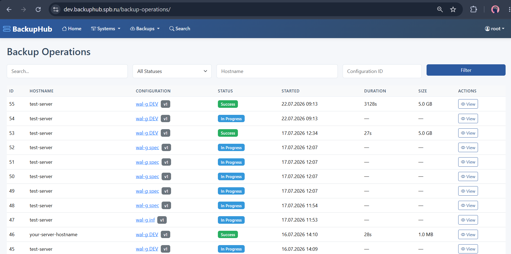
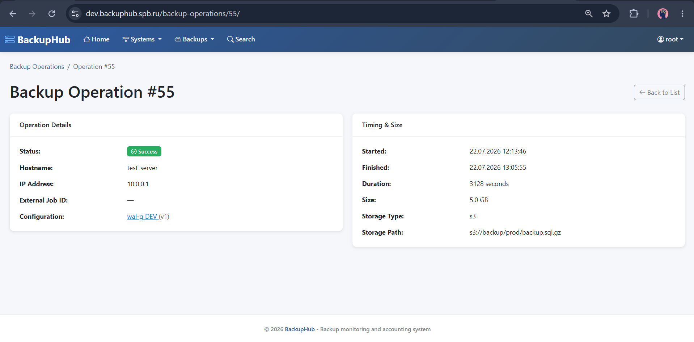

# 🧑‍💼 Руководство пользователя BackupHub

## 📋 Содержание

1. [О системе](#-о-системе)
2. [Начало работы и навигация](#-начало-работы-и-навигация)
3. [Target Systems — Целевые системы](#-target-systems--целевые-системы)
   - [Создание системы](#создание-системы)
   - [Просмотр и редактирование](#просмотр-и-редактирование)
   - [Справочники: System Types, Environments, Info Systems](#справочники)
   - [API Key и его использование](#api-key)
4. [Backup Configurations — Конфигурации бэкапа](#-backup-configurations--конфигурации-бэкапа)
   - [Создание конфигурации](#создание-конфигурации)
   - [Параметры версии бэкапа](#параметры-версии-бэкапа)
   - [Просмотр конфигурации](#просмотр-конфигурации)
   - [Копирование cURL](#-копирование-curl-для-вставки-на-сервере)
   - [История версий](#история-версий)
5. [Backup Operations — Операции бэкапа](#-backup-operations--операции-бэкапа)
   - [Просмотр списка операций](#просмотр-списка-операций)
   - [Детальная информация об операции](#детальная-информация-об-операции)
   - [Фильтрация и поиск](#фильтрация-и-поиск)
   - [Live-обновление](#live-обновление)
6. [Поиск](#-поиск)

---

## 📌 О системе

**BackupHub** — это централизованная веб-платформа для автоматизации учёта, планирования и мониторинга резервного копирования.

Система позволяет:

- Вести реестр **целевых систем** (серверов и сервисов), для которых выполняется бэкап
- Создавать **конфигурации бэкапов** с детальными параметрами (инструмент, режим, RPO/RTO, хранилище)
- Отслеживать **операции бэкапа** — каждый факт выполнения резервного копирования
- Получать **cURL-команды** для интеграции с внешними скриптами и системами

---

## 🚀 Начало работы и навигация

После входа в систему вы попадаете на **главную панель (Dashboard)**.


_Скриншот 1: Главная панель BackupHub со статистикой_

**На Dashboard отображаются:**

- **Total Systems** — общее количество систем
- **Total Backups** — общее количество операций бэкапа
- **Servers** — количество уникальных хостов
- **Backup Status (24h)** — статусы операций за последние 24 часа (Success, In Progress, Errors)
- **Recent Operations** — последние 10 операций
- **Systems** — таблица зарегистрированных систем

**Навигационное меню содержит разделы:**

| Раздел | Подразделы |
|---|---|
| **Systems** | Target Systems, System Types, Environments, Information Systems |
| **Backups** | Configurations, Operations, Backup Tools |
| **Search** | Глобальный поиск |

> **Совет:** Используйте быстрые кнопки "Add System", "Add Backup Config", "All Operations" на Dashboard для перехода к ключевым действиям.

---

## 🖥️ Target Systems — Целевые системы

**Target System** — это сервер, сервис или информационная система, для которой выполняется резервное копирование. Каждая система имеет уникальный **API Key**.

### Создание системы

1. Перейдите в **Systems → Target Systems** или нажмите "Add System" на Dashboard
2. Нажмите кнопку **"Create System"**


_Скриншот 2: Форма создания целевой системы_

**Заполните поля:**

| Поле | Описание |
|---|---|
| **System Type** | Тип системы (PostgreSQL, GitLab, Kubernetes и т.д.) |
| **Environment** | Окружение: Production, Test, Development |
| **Information System** | Привязка к информационной системе (опционально) |
| **System Name** | Уникальное имя системы (например, `prod-pg-master-01`) |
| **Description** | Описание и назначение |
| **Owner** | Владелец системы (ФИО ответственного) |
| **Administrator** | Администратор системы |
| **Active System** | Включено — система активна и готова к бэкапам |

> **Важно:** Поля **System Type** обязателен. Если нужного типа нет — нажмите кнопку `+` рядом с полем, чтобы создать новый.

3. Нажмите **"Save System"**

### Просмотр и редактирование

На странице деталей системы отображается:

- Базовая информация (тип, окружение, описание)
- **API Key** (скрыт, можно показать кнопкой 👁️)
- **Current Version** — текущая версия с указанием Owner и Administrator
- **Backup Configurations** — список конфигураций бэкапа для этой системы
- **Recent Backup Operations** — последние операции бэкапа


_Скриншот 3: Детальная страница целевой системы_

**Кнопки действий:**

- **Edit** — редактировать систему
- **Version History** — история изменения версий
- **Add Backup Config** — создать новую конфигурацию бэкапа для этой системы
- **Deactivate** — деактивировать систему

### Справочники

**System Types** — типы систем (PostgreSQL, MySQL, GitLab, Kubernetes и т.д.)


_Скриншот 4: Список типов систем_

**Environments** — окружения (Production, Test, Development)

**Information Systems** — информационные системы верхнего уровня (например, "ERP-система", "CRM", "Портал")

**Backup Tools** — инструменты резервного копирования (pg_dump, Velero, rsync, mysqldump и т.д.)

> Эти справочники можно редактировать через соответствующие пункты меню **Systems** и **Backups → Backup Tools**.

### API Key

**API Key** — это уникальный UUID, автоматически генерируемый при создании системы. Ключ используется для **аутентификации** при отправке данных через REST API.

**Как скопировать API Key:**

1. Откройте страницу деталей системы
2. Нажмите кнопку 👁️ (Show API Key) чтобы отобразить ключ
3. Нажмите кнопку 📋 (Copy to Clipboard) чтобы скопировать

> **Назначение:** API Key передаётся в HTTP-заголовке `X-API-Key` при вызове API из скриптов на серверах. Это защищает систему от несанкционированного доступа.

---

## ⚙️ Backup Configurations — Конфигурации бэкапа

**Backup Configuration** — это логическая группа настроек резервного копирования для конкретной версии целевой системы. Одна система может иметь несколько конфигураций (например, "Ежедневный полный бэкап" и "Еженедельный архивный").

### Создание конфигурации

1. Перейдите в **Backups → Configurations** или нажмите **"Add Backup Config"** на странице системы
2. Нажмите **"Create Configuration"**


_Скриншот 5: Форма создания конфигурации бэкапа_

### Параметры версии бэкапа

| Раздел | Поле | Описание |
|---|---|---|
| **General** | Target System Version | Привязка к системе и её версии |
| | Configuration Name | Название конфигурации |
| | Description | Описание |
| **Backup Parameters** | Backup Tool | Инструмент бэкапа (pg_dump, Velero, rsync...) |
| | Backup Mode | **Режим бэкапа** (см. таблицу ниже) |
| | Schedule (Cron) | CRON-выражение для планировщика (например, `0 2 * * *` — ежедневно в 2:00) |
| | Retention Period | Срок хранения бэкапов в днях |
| | RPO | **Recovery Point Objective** — максимально допустимая потеря данных (в минутах) |
| | RTO | **Recovery Time Objective** — максимально допустимое время восстановления (в минутах) |
| **Storage** | Storage Type | Тип хранилища (Local, S3, Azure, GCS, NFS, Other) |
| | Storage Path | Путь или URL хранилища |
| **Options** | Verify After Backup | Автоматическая проверка целостности бэкапа |
| | Immutable Storage | Неизменяемое хранилище (бэкапы нельзя удалить/изменить) |
| | Active Configuration | Включено — конфигурация активна |

#### Режимы бэкапа

| Режим | Описание |
|---|---|
| **Full** | Полный бэкап всех данных |
| **Incremental** | Инкрементальный — только изменения с последнего бэкапа |
| **Differential** | Дифференциальный — только изменения с последнего полного бэкапа |
| **Physical** | Физическое копирование (например, снапшоты дисков) |
| **Logical** | Логическое копирование (например, SQL-дамп) |

### Просмотр конфигурации

На странице деталей отображается:

- **Configuration Information** — базовая информация и **cURL-примеры**
- **Current Version Parameters** — все параметры текущей версии
- **Recent Backup Operations** — последние операции по этой конфигурации


_Скриншот 6: Детальная страница конфигурации бэкапа_

### 📋 Копирование cURL для вставки на сервере

На странице конфигурации есть блок **"API cURL Examples"**. Нажмите кнопку **"Show API cURL examples"**, чтобы развернуть его.


_Скриншот 7: Примеры cURL-команд для ручного запуска и завершения бэкапа_

**В блоке два примера:**

**1. POST — Создать новую операцию бэкапа (запуск)**

```bash
curl -X POST "https://backuphub.example.com/api/v1/backup-operations/" \
  -H "X-API-Key: ваш-api-key" \
  -H "Content-Type: application/json" \
  -d '{
      "backup_configuration_id": 1,
      "hostname": "your-server-hostname",
      "ip_address": "10.0.0.1"
  }'
```

**2. PATCH — Завершить операцию бэкапа (отправить результат)**

```bash
curl -X PATCH "https://backuphub.example.com/api/v1/backup-operations/{operation_id}/" \
  -H "X-API-Key: ваш-api-key" \
  -H "Content-Type: application/json" \
  -d '{
      "status": "success",
      "size_bytes": 1048576,
      "storage_type": "local",
      "storage_path": "/path/to/backup.tar.gz"
  }'
```

> **Как использовать:**
> 1. Скопируйте команду кнопкой **Copy**
> 2. Вставьте на сервере, где выполняется бэкап
> 3. Замените `hostname` и `ip_address` на данные вашего сервера
> 4. Выполните POST — получите `operation_id` в ответе
> 5. После завершения бэкапа выполните PATCH с реальными данными

### История версий

Каждая конфигурация поддерживает **версионирование**. При изменении параметров создаётся новая версия, а старая сохраняется в истории.


_Скриншот 8: История версий конфигурации_

Это позволяет:

- Отслеживать, когда и кем были изменены параметры
- Видеть, какие параметры действовали на момент конкретной операции бэкапа
- Соблюдать требования аудита

---

## 📊 Backup Operations — Операции бэкапа

**Backup Operation** — это запись о факте выполнения резервного копирования. Каждая операция привязана к версии конфигурации и содержит результат.

### Просмотр списка операций

Перейдите в **Backups → Operations**.


_Скриншот 9: Список операций бэкапа_

В таблице отображаются:

| Колонка | Описание |
|---|---|
| **ID** | Уникальный номер операции |
| **Hostname** | Сервер, с которого выполнен бэкап |
| **Configuration** | Название конфигурации (+ версия) |
| **Status** | Статус (цветовой индикатор) |
| **Started** | Дата и время начала |
| **Duration** | Длительность в секундах |
| **Size** | Размер бэкапа в человекочитаемом формате |

### Статусы операций

| Статус | Значение |
|---|---|
| ✅ **Success** | Бэкап выполнен успешно |
| ❌ **Error** | Ошибка выполнения (текст ошибки в деталях) |
| ⏳ **In Progress** | Бэкап выполняется в данный момент |
| ⚠️ **Warning** | Выполнено с предупреждениями |
| 🚫 **Cancelled** | Операция отменена |

### Детальная информация об операции


_Скриншот 10: Детальная страница операции бэкапа_

На странице деталей дополнительно отображаются:

- **External Job ID** — внешний идентификатор задания (если используется)
- **IP Address** — IP-адрес сервера
- **Error Message** — сообщение об ошибке (если статус Error)
- **Metadata** — дополнительные метаданные в формате JSON
- **Storage Type / Path** — где хранится бэкап

### Live-обновление

Список операций и Dashboard **автоматически обновляются** каждые 5 секунд (через API). Вы видите актуальные статусы без перезагрузки страницы.

---

## 🔍 Поиск

Глобальный поиск доступен через пункт меню **Search** или по иконке 🔍.

Поиск выполняется одновременно по:

- Target Systems (название, описание)
- Backup Configurations (название, описание)
- Backup Operations (hostname, error_message)

---

## 💡 Типовой сценарий работы

1. **Создайте Target System** — зарегистрируйте сервер, укажите тип и ответственных
2. **Создайте Backup Configuration** — задайте инструмент, режим, расписание и хранилище
3. **Скопируйте cURL команды** — вставьте их в скрипт на сервере
4. **Сервер отправляет данные** — POST при старте, PATCH при завершении
5. **Контролируйте статус** — смотрите операции в реальном времени на Dashboard
6. **Анализируйте** — используйте фильтры, историю версий, отчёты

---

*Документация актуальна на 2026 год. Для вопросов обращайтесь к команде разработки BackupHub.*